# Diagramas

## 1. Registro e Autenticação de Usuário

### Diagrama de Fluxo de Dados

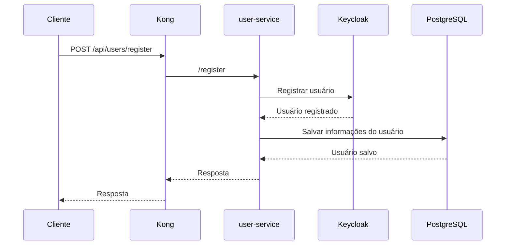

### História de Usuário

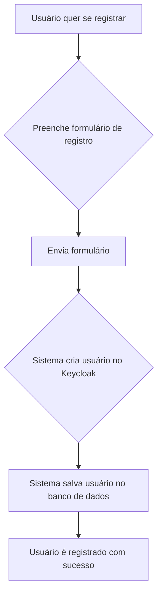

## 2. Envio de Mensagem de Chat

### Diagrama de Fluxo de Dados

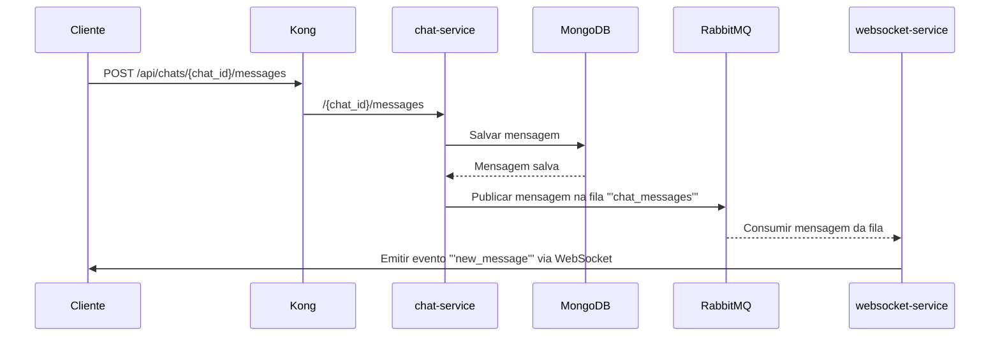

### História de Usuário

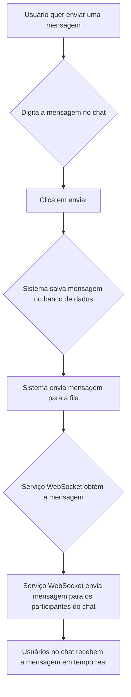

## 3. Notificações em Tempo Real

### Diagrama de Fluxo de Dados

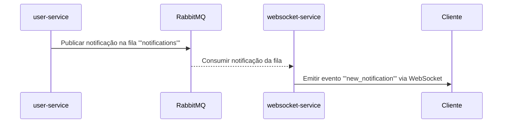

### História de Usuário

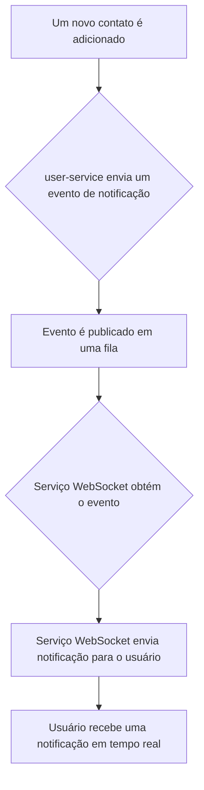

## 4. Login de Usuário

### Diagrama de Fluxo de Dados

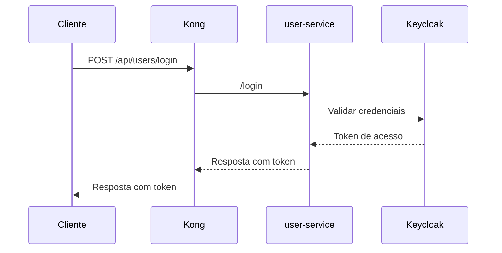

## 5. Pesquisar e Conectar com Usuário

### Diagrama de Fluxo de Dados

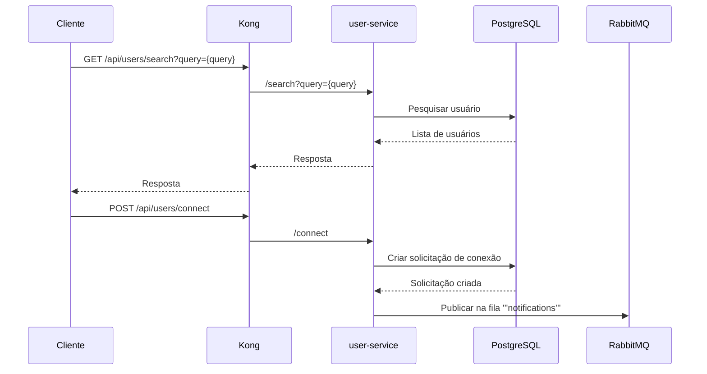

## 6. Notificação de Solicitação de Conexão

### Diagrama de Fluxo de Dados

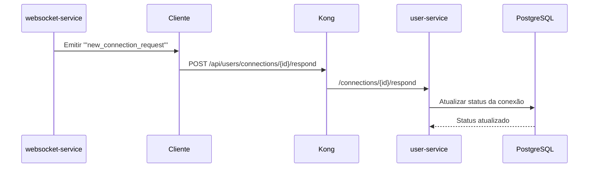

## 7. Iniciar um Chat

### Diagrama de Fluxo de Dados

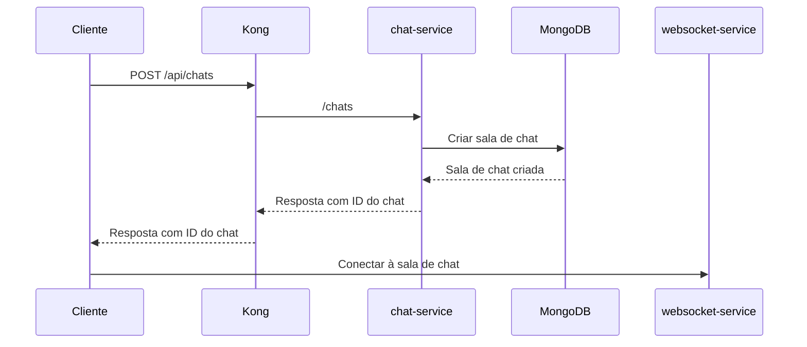

## 8. Gerenciamento de Perfil de Usuário

### Diagrama de Fluxo de Dados

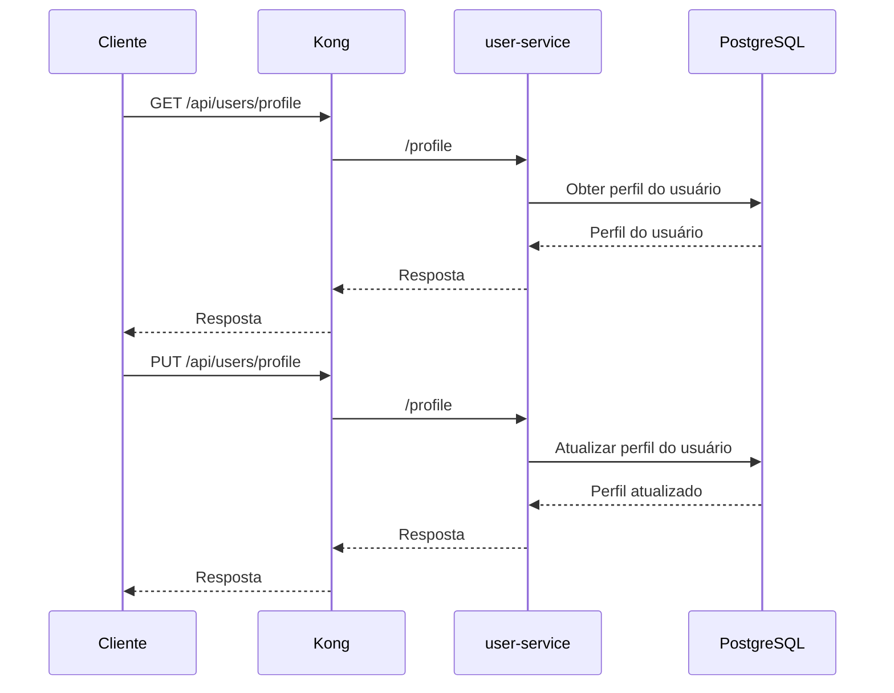

### História de Usuário

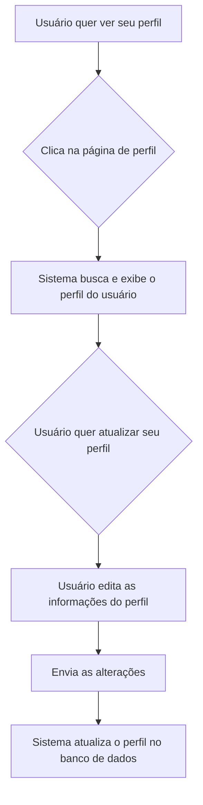

## 9. Gerenciamento de Notificações

### Diagrama de Fluxo de Dados

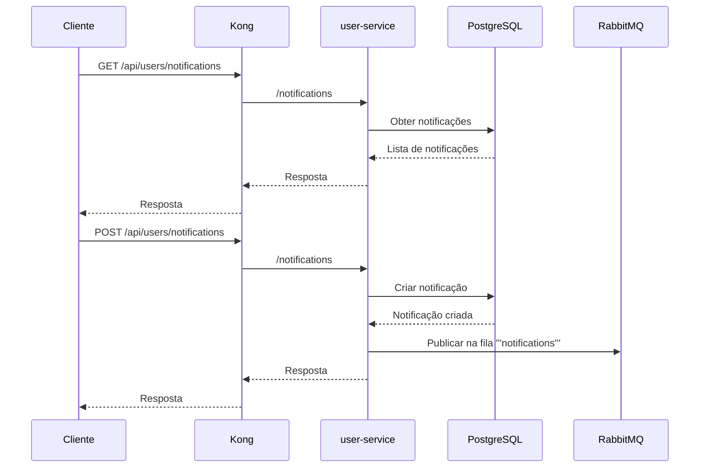

### História de Usuário

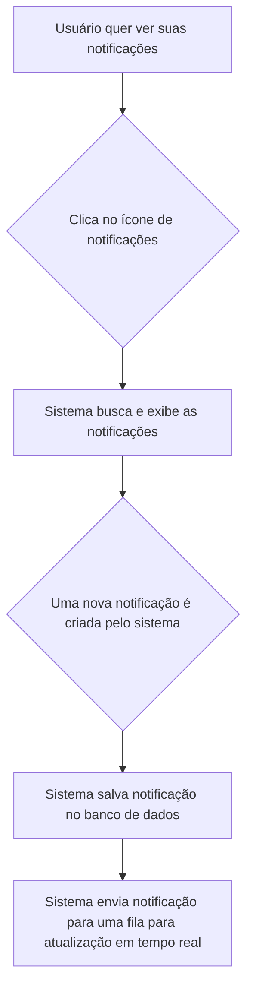

## 10. Gerenciamento de Chat

### Diagrama de Fluxo de Dados

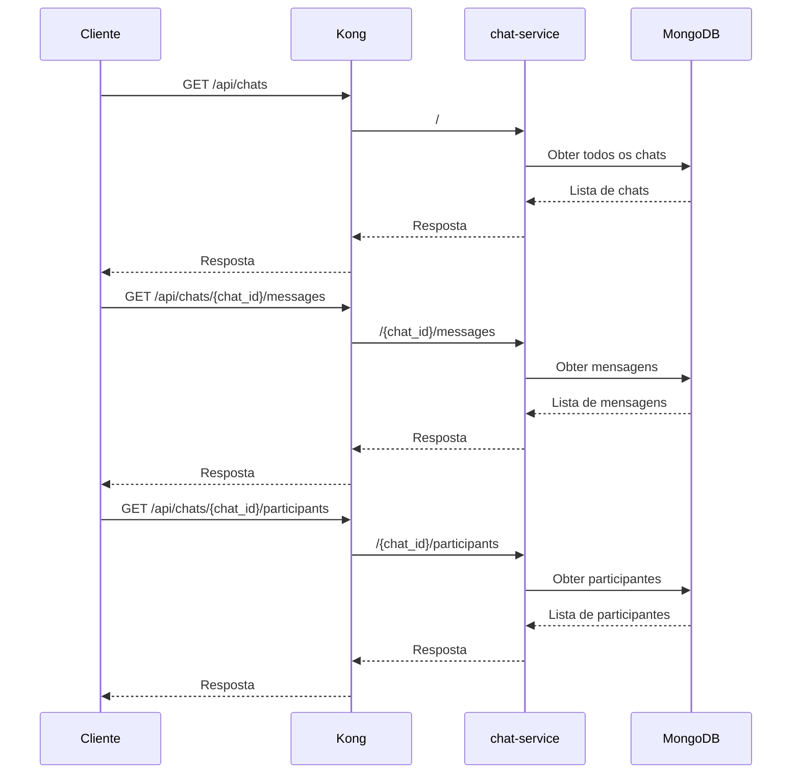

### História de Usuário

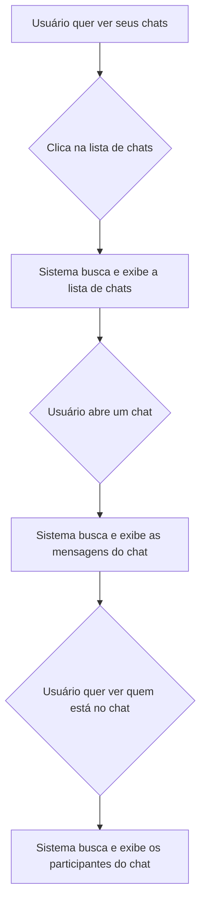
